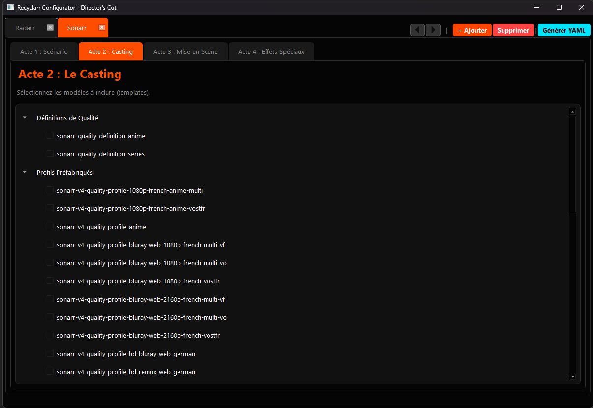

# Recyclarr Configurator - Director's Cut 🎬

[](https://www.python.org/downloads/)
[](https://wiki.qt.io/Qt_for_Python)
[](https://opensource.org/licenses/MIT)

**The ultimate tool for configuring Recyclarr.**
A modern graphical application (PySide6) to generate YAML configuration files for [Recyclarr](https://github.com/recyclarr/recyclarr), optimized for home server enthusiasts.



---

## 🌟 What's New in "Director's Cut"

This revised version brings a complete overhaul of the user experience, structured into **4 Acts** for intuitive configuration:
*   **Act 1 - The Script**: Base settings and Template selection.
*   **Act 2 - The Casting**: Include libraries (Custom Formats, Quality Defs).
*   **Act 3 - Staging**: Advanced quality profile creation (Drag & Drop, Groups).
*   **Act 4 - Special Effects**: Custom Format editor with smart score inference and comments.

## ✨ Features

*   **🎨 "Dark Cinema" Interface**: Immersive and responsive dark theme.
*   **📱 Multi-Instance Management**: Dynamic tabs to manage Radarr 4K, Radarr 1080p, Sonarr, etc.
*   **🔄 Auto Sync**: Automatically downloads the latest TRaSH Guides data at startup.
*   **📂 Import Configuration**: Load existing YAML files to modify your setup.
*   **🧠 Smart Score Inference**: Intelligent score assignment for custom formats (detects aliases like "french" -> "fr").
*   **💬 YAML Comments**: Automatically adds format names as comments in the generated YAML for better readability.
*   **🛡️ Quality Protection**: Prevents accidental nesting of qualities in the profile builder (only groups allow nesting).
*   **📂 Template Deep Scan**: Full recursive loading of all templates and includes.
*   **🖱️ Drag & Drop**: Easy quality grouping (e.g., Bluray + WebDL).
*   **⚡ Performance**: Smooth navigation and standardized vector icons.

## 🚀 Quick Start

1.  **Installation**
    ```bash
    pip install -r requirements.txt
    ```

2.  **Launch**
    ```bash
    python main_gui_app.py
    ```

👉 **For more details, check the [FULL DOCUMENTATION](DOCUMENTATION.md).**

## 📂 Project Structure

```
recyclarr-config/
├── core/                   # Logic core (DataManager, Models, Generator)
├── ui/                     # UI Components and styles
├── main_gui_app.py         # Main entry point
├── DOCUMENTATION.md        # Detailed user guide
├── requirements.txt        # Dependencies
└── ...
```

## 🤝 Contributing

Contributions are welcome! Feel free to open an Issue or a Pull Request.

## 📄 License

MIT

---
*Made with ❤️ for the Home Server community.*
