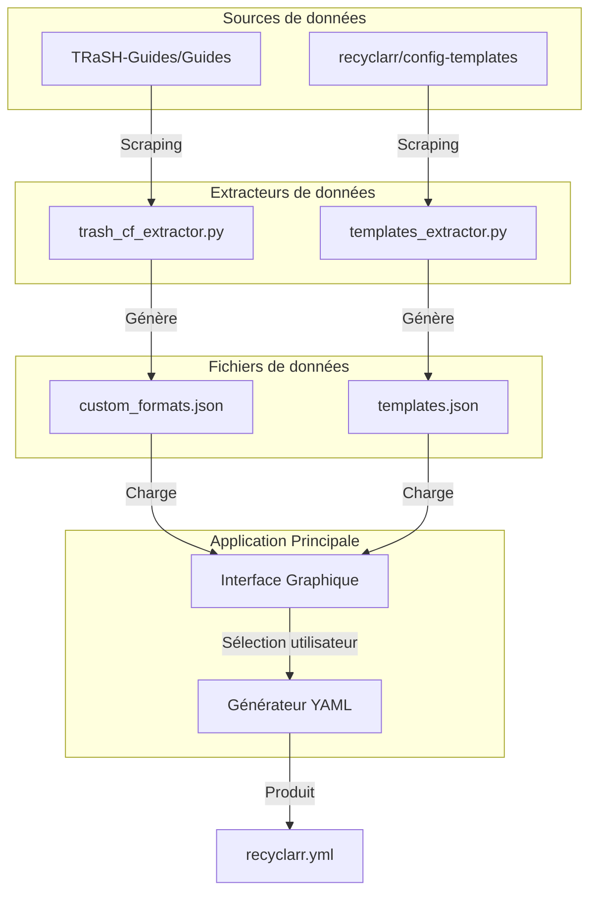
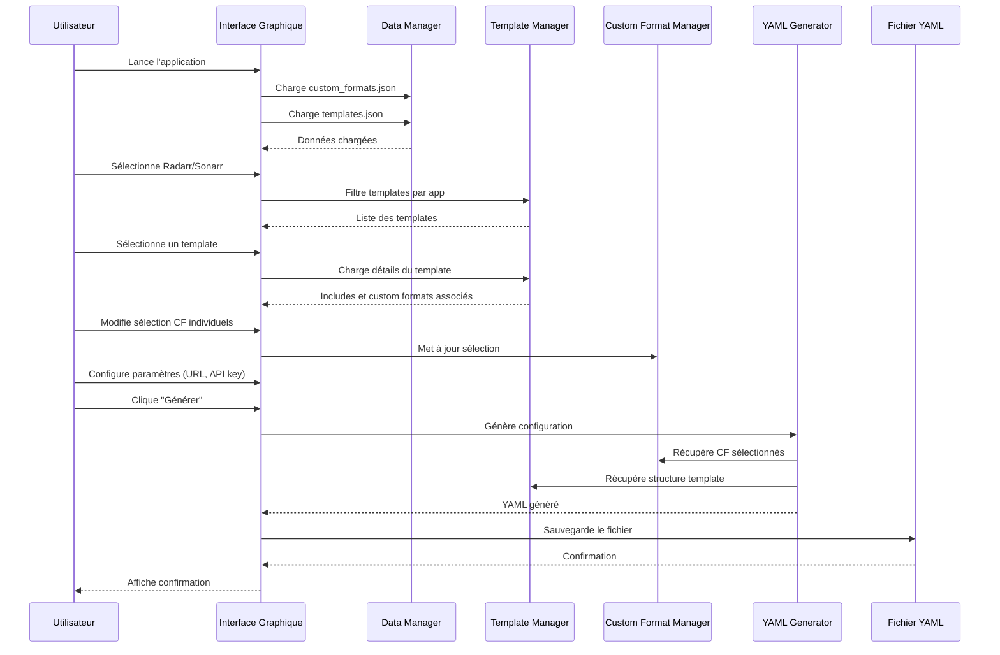

# Architecture du Générateur de Configuration Recyclarr

## Vue d'ensemble

Ce projet est un générateur de fichiers de configuration YAML pour [Recyclarr](https://github.com/recyclarr/recyclarr) avec une interface graphique. Il utilise les templates officiels et les Custom Formats du TRaSH Guide.



---

## 1. Partie 1: trash_cf_extractor.py (EXISTANT)

**Fichier**: [`trash_cf_extractor.py`](../trash_cf_extractor.py)

**Rôle**: Extrait les Custom Formats du dépôt TRaSH-Guides

**Source**: `https://github.com/TRaSH-Guides/Guides`

**Structure du JSON généré**:
```json
{
  "metadata": {
    "generated_at": "2026-01-31T12:40:02Z",
    "source": "https://github.com/TRaSH-Guides/Guides",
    "total_formats": 409
  },
  "custom_formats": {
    "radarr": {
      "count": 206,
      "formats": [
        {
          "name": "Nom du format",
          "trash_id": "abc123...",
          "description": "Description...",
          "trash_scores": {
            "default": 100,
            "profile1": 150
          },
          "app": "radarr"
        }
      ]
    },
    "sonarr": { ... },
    "guide-only": { ... }
  }
}
```

---

## 2. Partie 2: templates_extractor.py (À CRÉER)

**Fichier**: `templates_extractor.py`

**Rôle**: Extrait les templates et includes du dépôt recyclarr/config-templates

**Source**: `https://github.com/recyclarr/config-templates`

### Structure des données à extraire

```json
{
  "metadata": {
    "generated_at": "2026-01-31T12:40:02Z",
    "source": "https://github.com/recyclarr/config-templates",
    "version": "master"
  },
  "radarr": {
    "templates": [
      {
        "name": "french-hd-bluray-web",
        "file": "french-hd-bluray-web.yml",
        "description": "Template pour films français HD Bluray + WEB",
        "includes": [
          "radarr-quality-definition-movie",
          "radarr-quality-profile-hd-bluray-web-french-multi-vo",
          "radarr-custom-formats-hd-bluray-web-french-multi-vo"
        ],
        "url": "https://raw.githubusercontent.com/.../french-hd-bluray-web.yml"
      }
    ],
    "includes": {
      "quality-definitions": [...],
      "quality-profiles": [...],
      "custom-formats": [
        {
          "name": "radarr-custom-formats-anime",
          "file": "radarr-custom-formats-anime.yml",
          "trash_ids": ["id1", "id2", ...],
          "assign_scores_to": ["profile1", "profile2"]
        }
      ]
    }
  },
  "sonarr": {
    "templates": [...],
    "includes": {...}
  }
}
```

### Architecture du scraper

```python
class ConfigTemplatesExtractor:
    """Extracteur pour le repo config-templates"""
    
    REPO_OWNER = "recyclarr"
    REPO_NAME = "config-templates"
    BRANCH = "master"
    
    def extract_all(self) -> dict:
        """Extrait tous les templates et includes"""
        return {
            "radarr": self._extract_app("radarr"),
            "sonarr": self._extract_app("sonarr")
        }
    
    def _extract_app(self, app: str) -> dict:
        """Extrait les templates pour une application"""
        return {
            "templates": self._extract_templates(app),
            "includes": self._extract_includes(app)
        }
```

---

## 3. Partie 3: Application principale avec GUI

**Fichier**: `recyclarr_gui.py` (point d'entrée)

### Modules

#### 3.1 `gui/` - Interface Graphique

```
gui/
├── __init__.py
├── main_window.py          # Fenêtre principale
├── template_selector.py    # Sélection des templates
├── cf_selector.py          # Sélection des custom formats
├── preview_panel.py        # Prévisualisation YAML
└── config_editor.py        # Édition des paramètres
```

#### 3.2 `core/` - Logique métier

```
core/
├── __init__.py
├── data_manager.py         # Gestion des données JSON
├── template_manager.py     # Gestion des templates
├── cf_manager.py           # Gestion des custom formats
└── yaml_generator.py       # Générateur YAML
```

#### 3.3 `models/` - Modèles de données

```
models/
├── __init__.py
├── custom_format.py        # Modèle Custom Format
├── template.py             # Modèle Template
└── recyclarr_config.py     # Modèle Configuration Recyclarr
```

---

## 4. Structure de la configuration générée

### Exemple de fichier YAML produit

```yaml
# Configuration Recyclarr générée par Recyclarr Config Generator
# Date: 2026-01-31

radarr:
  instance1:
    base_url: http://localhost:7878
    api_key: VOTRE_API_KEY
    
    include:
      - template: radarr-quality-definition-movie
      - template: radarr-quality-profile-hd-bluray-web-french-multi-vo
      - template: radarr-custom-formats-hd-bluray-web-french-multi-vo
    
    custom_formats:
      - trash_ids:
          - 570bc9ebecd92723d2d21500f4be314c  # Remaster
          - eca37840c13c6ef2dd0262b141a5482f  # 4K Remaster
        assign_scores_to:
          - name: HD Bluray + WEB
    
    quality_profiles:
      - name: HD Bluray + WEB
        reset_unmatched_scores: true
        upgrade:
          allowed: true
          until_quality: Bluray-1080p
          until_score: 10000
        min_format_score: 0
        quality_sort: top
        qualities:
          - name: Bluray-1080p
          - name: WEB-1080p
          - name: Bluray-720p
          - name: WEB-720p

sonarr:
  instance1:
    base_url: http://localhost:8989
    api_key: VOTRE_API_KEY
    # ... configuration similaire
```

---

## 5. Flux de travail de l'application



---

## 6. Dépendances Python

```
# requirements.txt
requests>=2.31.0
pyyaml>=6.0.1
tkinter-tooltip>=2.1.0  # Pour les tooltips
packaging>=23.2
```

---

## 7. Structure des fichiers du projet

```
recyclarr-config/
├── trash_cf_extractor.py           # Partie 1: Existant
├── templates_extractor.py          # Partie 2: Nouveau
├── recyclarr_gui.py                # Partie 3: Point d'entrée GUI
├── custom_formats.json             # Données CF (généré)
├── templates.json                  # Données templates (généré)
├── requirements.txt
├── README.md
├── plans/
│   └── architecture.md             # Ce fichier
├── gui/
│   ├── __init__.py
│   ├── main_window.py
│   ├── template_selector.py
│   ├── cf_selector.py
│   ├── preview_panel.py
│   └── config_editor.py
├── core/
│   ├── __init__.py
│   ├── data_manager.py
│   ├── template_manager.py
│   ├── cf_manager.py
│   └── yaml_generator.py
└── models/
    ├── __init__.py
    ├── custom_format.py
    ├── template.py
    └── recyclarr_config.py
```

---

## 8. Prochaines étapes

1. **Créer `templates_extractor.py`**: Scraper le repo config-templates
2. **Définir les modèles de données**: Classes Python pour représenter les données
3. **Créer le module YAML**: Générer le YAML valide pour Recyclarr
4. **Implémenter la GUI**: Interface tkinter avec sélection et prévisualisation
5. **Tester et documenter**: Vérifier que les configs générées fonctionnent
